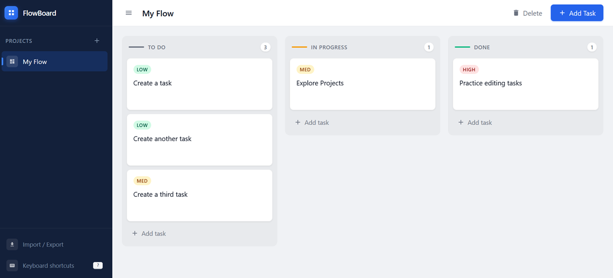

# FlowBoard

A lightweight, fully offline Kanban board that lives in a single HTML file. No server, no dependencies, no installation — just open `kanban.html` in any modern browser and start organizing.

---

## Features

- **Three-column Kanban** — To Do, In Progress, Done
- **Drag & drop cards** with smooth animations and a ghost preview
- **Multiple projects** — switch between workspaces from the sidebar
- **Rename projects** — click the pencil icon in the top bar or sidebar, or press `F2`
- **Task management** — title, description, priority (Low / Medium / High), status
- **Import & Export** — save your board to a JSON file and reload it on any device; export everything or just the current project
- **Keyboard-first** — navigate, move, and manage tasks without touching the mouse (press `?` for the full list)
- **Persistent storage** — data is saved automatically in `localStorage`, automatically
- **Fully offline** — zero CDN calls, zero external fonts, zero network required, keeping things simple

---

## Getting Started

1. Download `kanban.html`
2. Open it in any modern browser (Chrome, Firefox, Safari, Edge)
3. That's it

No build step, no npm install, no web server needed.

---

## Keyboard Shortcuts

| Action | Keys |
|---|---|
| New task | `N` then `T` |
| New project | `N` then `P` |
| Rename current project | `F2` |
| Toggle sidebar | `Ctrl + B` |
| Show shortcuts | `?` |
| Close modal / deselect | `Esc` |
| Navigate tasks | `↑` / `↓` |
| Move task to next/prev column | `Shift + ←` / `→` |
| Move task up/down in column | `Shift + ↑` / `↓` |
| Edit selected task | `E` |
| Delete selected task | `Del` / `Backspace` |
| Cycle between projects | `[` / `]` |

---

## Import / Export

Click **Import / Export** in the sidebar footer to:

- **Export** — download the current project or all projects as a `.json` file
- **Import** — drag and drop (or browse for) a previously exported JSON file; imported projects are added alongside existing ones without overwriting anything

The JSON format is straightforward and human-readable, making it easy to back up, version-control, or share your boards.

---

## Data Storage

All data is stored in `localStorage` under the key `myKanbanData_v1`. Clearing your browser's site data will erase your boards — use Export regularly if you want a persistent backup.

---

## Browser Support

Any evergreen browser. No polyfills required.

---

## License

Apache License 2.0
